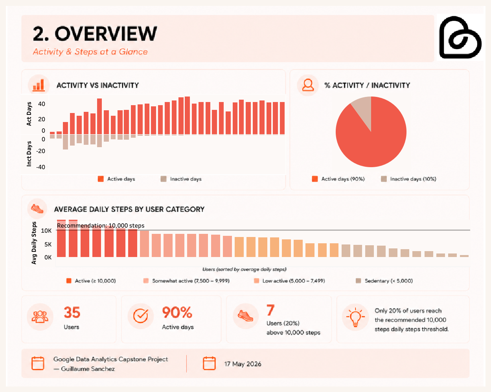

# bellabeat-fitness-analysis
End-to-end fitness data analysis using SQL, BigQuery and Tableau to identify user behavior patterns and provide business recommendations for Bellabeat

---

## 🏃 Bellabeat Fitness Data Analysis

## 💻 Project Overview

This project was completed as part of the Google Data Analytics Professional Certificate

The objective was to analyze smart device fitness data to identify user behavior patterns and provide actionable business recommendations for Bellabeat, a wellness technology company focused on women's health

Using SQL (BigQuery) and Tableau, the analysis explores physical activity, sleep habits, sedentary behavior, and the relationships between these metrics

---

## 🎯 Business Task

Bellabeat wants to better understand how consumers use smart fitness devices and how these insights can support future marketing and product strategies

#### Key Questions:
- How active are Bellabeat users ?
- What are their sleep habits ?
- Are there identifiable behavioral patterns ?
- How are activity and sleep related ?
- What business opportunities emerge from the analysis ?

---
  
## 💾 Source

FitBit Fitness Tracker Data (Kaggle)

| Table            | Description                    | Users | 
| ---------------- | ------------------------------ | ----- |
| Daily Activity   | Daily activity metrics         | 35    |
| Hourly Steps     | Hourly step counts             | 33    |
| Sleep Time       | Sleep tracking records         | 25    |
| Activity & Sleep | Merged activity and sleep data | 24    |

| Tool           | Purpose                     |
| -------------- | --------------------------- |
| SQL (BigQuery) | Data cleaning and analysis  |
| Tableau        | Data visualization          |
| Kaggle         | Project publication         |
| GitHub         | Documentation and portfolio |

---
## 📅 Period

12 March 2016 – 12 May 2016

---
## 📝 Data Preparation

The analysis followed a structured workflow:

**Exploratory Analysis**
- Dataset structure review
- Duplicate detection
- User coverage validation
- Data quality assessment

**Data Cleaning**
- Duplicate removal
- Date standardization
- Activity metric validation
- Creation of analysis-ready tables

📓 SQL queries are available in the /sql folder

---
## 🚩 Limitations

- The dataset contains activity and sleep records from a limited sample of Fitbit users
- Data was collected over approximately two months, which may not reflect long-term behavior
- Device non-wear or partial wear may affect the accuracy of activity and sleep measurements
- Demographic information was unavailable, limiting user segmentation and personalization analysis
- Observed relationships represent correlations and should not be interpreted as causal effects
- The dataset was collected in 2016, user behavior and wearable technology usage may have evolved since then

---
## 📊 Analysis Highlights
### 1. Activity Patterns
#### 🔑 Key Findings
- Activity peaks occur around 12 PM, 6 PM, and 7 PM
- Saturday records the highest average activity level
- Activity schedules differ substantially between users

#### ⚡ Insight

- Activity patterns differ across users, making personalized reminders more effective

### 2. Sleep Habits
#### 🔑 Key Findings
- 76% of users fall below recommended sleep levels
- Only 24% meet the recommended 7–8 hour range
- Sleep duration increases on weekends
  
#### ⚡ Insight

- 76% of users fall below recommended sleep levels

### 3. Activity & Sleep
#### 🔑 Key Findings
- More active users generally sleep longer
- Higher activity levels are associated with fewer restless minutes
- Sedentary time remains high across all groups

#### ⚡ Insight

- Healthier activity profiles are generally associated with better sleep outcomes

📝 **Note:** The previous analysis identified patterns between activity levels and sleep outcomes. To determine whether these patterns reflect meaningful relationships, a correlation analysis was performed between key activity and sleep variables

### 4. Activity Correlation Analysis
#### 🔑 Key Findings
- No significant relationship between daily steps and sleep duration (R² ≈ 0.01)
- Daily steps show only a weak relationship with calorie expenditure (R² ≈ 0.05)
- No significant relationship between very active minutes and restless sleep (R² ≈ 0.02)
- Sedentary behavior shows the strongest observed relationship with sleep duration (R² ≈ 0.64)

#### ⚡ Insight

- Sedentary behavior shows the strongest observed relationship with sleep duration, suggesting it may be an important factor to monitor alongside overall activity levels

---
## 🏆 Business Recommendations
**1. Personalize Engagement by Activity Profile**

- Deliver notifications, challenges, and coaching content aligned with each user's preferred activity window

**2. Promote Awareness of Sleep and Sedentary Behaviors**

- Provide personalized insights showing how sedentary behavior may affect sleep duration

**3. Target the Under-Sleeping Majority**

- Develop features focused on sleep improvement, including bedtime reminders and sleep quality tracking

**4. Address Sedentary Time Through Movement Nudges**

- Encourage regular movement throughout the day to reduce inactivity

**5. Encourage Consistent Night Wear**

- Increase sleep data coverage through onboarding prompts and sleep-tracking education

---
## 📷 Dashboard Preview

---
## 🛠 Skills Demonstrated

- SQL
- BigQuery
- Tableau
- Exploratory Data Analysis
- Data Cleaning
- Data Visualization
- Data Storytelling
- Business Recommendations

---
## 📎 Project Links
Tableau Dashboard

[View Interactive Tableau Dashboard](https://public.tableau.com/views/BellabeatFitnessDataAnalysis_17788563227930/Coverpage?:language=es-ES&:sid=&:display_count=n&:origin=viz_share_link)

Kaggle Notebook

[View Full Kaggle Analysis](https://www.kaggle.com/code/guillaumesanchez4/bellabeat-case-study)

---
## 👤 Author

Guillaume Sanchez

Data Analyst | SQL • BigQuery • Tableau • Data Storytelling
